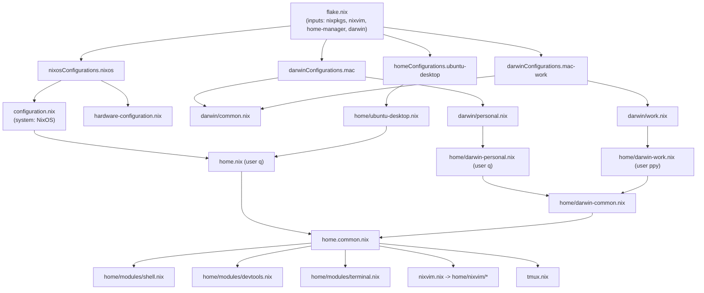
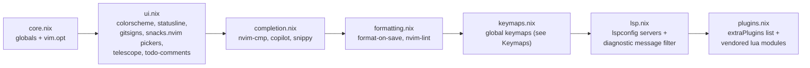
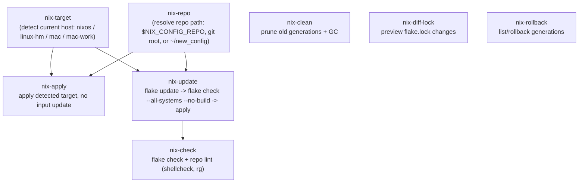

# Configuration Reference

Deep-dive documentation for this repository: what each file does, how the
pieces wire together, and every keybinding defined anywhere in the config.
For quick-start install commands, see [README.md](./README.md). This file
is the "how it all fits together" reference.

## Table of contents

- [Big picture](#big-picture)
- [Flake outputs](#flake-outputs)
- [Repository layout](#repository-layout)
- [Targets](#targets)
  - [NixOS (`nixos`)](#nixos-nixos)
  - [macOS personal (`mac`)](#macos-personal-mac)
  - [macOS work (`mac-work`)](#macos-work-mac-work)
  - [Ubuntu desktop (`ubuntu-desktop`)](#ubuntu-desktop-ubuntu-desktop)
- [Home Manager modules](#home-manager-modules)
- [Neovim (nixvim)](#neovim-nixvim)
- [tmux](#tmux)
- [VS Code](#vs-code)
- [Helper scripts](#helper-scripts)
- [Secrets](#secrets)
- [Keymaps](#keymaps)
  - [Neovim](#neovim-keymaps)
  - [tmux](#tmux-keymaps)
  - [VS Code (Vim emulation)](#vs-code-keymaps)
  - [OS-level key remaps](#os-level-key-remaps)

## Big picture

One flake (`flake.nix`) is the single entry point for four independent
outputs: a NixOS system, two nix-darwin systems (personal + work), and a
standalone Home Manager profile for Ubuntu. System modules configure the
OS; Home Manager modules configure the user environment (shell, editor,
terminal multiplexer, dev tools) and are shared across all targets that
support them.



Note: `home.common.nix` imports `./vscode.nix` too, but that line is
currently commented out ("Temporarily disabled for all hosts"), so VS Code
config exists in the repo but is not applied by any target right now.

## Flake outputs

Defined in [`flake.nix`](./flake.nix):

| Output | Command | Notes |
|---|---|---|
| `nixosConfigurations.nixos` | `sudo nixos-rebuild switch --flake .#nixos` | Full NixOS system + Home Manager module for user `q` |
| `darwinConfigurations.mac` | `sudo darwin-rebuild switch --flake .#mac` | nix-darwin, user `q`, personal machine |
| `darwinConfigurations.mac-work` | `sudo darwin-rebuild switch --flake .#mac-work` | nix-darwin, user `ppy`, work machine |
| `homeConfigurations.ubuntu-desktop` | `nix run home-manager -- switch --flake .#ubuntu-desktop` | Standalone Home Manager, no system module (non-NixOS Linux) |
| `apps.x86_64-linux.home-manager` | `nix run .#home-manager` | Exposes the locked Home Manager CLI |
| `checks` | `nix flake check --all-systems --no-build` | Dummy derivations that force-evaluate every configuration's `toplevel`/`activationPackage`/`system` |

Both `nixpkgs` instances (`pkgs` for `x86_64-linux`, `pkgsDarwin` for
`aarch64-darwin`) are built with `allowUnfree = true`. The `nixvim` input
follows the same `nixpkgs` lock via `nixvim.inputs.nixpkgs.follows`, as does
`home-manager` and `darwin`, so there is exactly one nixpkgs revision in play.

## Repository layout

```
.
├── flake.nix / flake.lock       # root entry point, lock owner
├── configuration.nix            # NixOS system config
├── hardware-configuration.nix   # NixOS hardware config
├── darwin/
│   ├── common.nix               # shared macOS system settings
│   ├── personal.nix             # host "mac", user q, Homebrew casks
│   └── work.nix                 # host "mac-work", user ppy
├── home.nix                     # Linux (NixOS) user config
├── home.common.nix              # shared Home Manager config (all targets)
├── home/
│   ├── darwin-common.nix        # shared macOS user config
│   ├── darwin-personal.nix      # user q on macOS
│   ├── darwin-work.nix          # user ppy on macOS (SSH-signed commits)
│   ├── ubuntu-desktop.nix       # Ubuntu-specific Home Manager profile
│   ├── modules/
│   │   ├── devtools.nix         # git, delta, CLI tools, LSP servers, formatters
│   │   ├── shell.nix            # zsh + oh-my-zsh + p10k + aliases
│   │   ├── terminal.nix         # Ghostty config
│   │   └── toolchains.nix       # language toolchains (opt-in module)
│   ├── nixvim/                  # modular Neovim config (see below)
│   └── vscode/                  # VS Code settings/keybindings/extensions (currently disabled)
├── nixvim.nix                   # imports home/nixvim/ui.nix into Home Manager
├── vscode.nix                   # imports home/vscode/keybindings.nix
├── tmux.nix                     # tmux config + plugins
├── p10k.zsh                     # Powerlevel10k prompt config
├── pkgs/scripts.nix             # builds all `nix-*` helper commands
├── scripts/                     # shell source for the helper commands
├── secrets/                     # placeholder for sops-nix (currently unused)
├── vendor/                      # local Neovim plugin sources
└── AGENTS.md, README.md         # agent instructions / quick-start docs
```

## Targets

### NixOS (`nixos`)

[`configuration.nix`](./configuration.nix) is a single-host NixOS config
(hostname `nixos`) tuned for a desktop with an NVIDIA GPU:

- **Boot/kernel**: systemd-boot, Plymouth spinner, NVIDIA kernel modules
  loaded early in initrd, `nouveau` blacklisted.
- **Display**: GDM + GNOME, `xkb` layout `us,ru` with
  `grp:alt_space_toggle,ctrl:nocaps` (Alt+Space switches layout, CapsLock
  becomes Ctrl).
- **Graphics**: `hardware.nvidia` with the `production` kernel package,
  GSP firmware enabled, `hardware.graphics` (25.11's replacement for
  `hardware.opengl`) with 32-bit support for gaming/Steam.
- **Networking**: NetworkManager, Tailscale, Mullvad VPN, firewall enabled
  with no extra open ports.
- **Audio**: PipeWire (Pulse/ALSA compat), PulseAudio disabled.
- **Security hardening**: AppArmor, `sudo` requires a password, root login
  disabled (`hashedPassword = "!"`), restrictive `sysctl` (`kptr_restrict`,
  `dmesg_restrict`, `ptrace_scope`, no ICMP redirects, SYN cookies).
- **User**: `q`, zsh shell, in `networkmanager`/`wheel`/`video`.
- **Extras**: 1Password (CLI + GUI with polkit for `q`), Steam +
  gamemode, JetBrains Mono + Nerd Font, automatic daily upgrades
  (`system.autoUpgrade`, no auto-reboot) and weekly GC
  (`nix.gc`, keep 10 days).
- Imports the Home Manager module for user `q` via `home.nix`.

### macOS personal (`mac`)

[`darwin/personal.nix`](./darwin/personal.nix) imports
[`darwin/common.nix`](./darwin/common.nix) (Touch ID for sudo, key
remapping enabled, fast key repeat, Homebrew's zsh env sourced) and adds:

- Homebrew managed via nix-darwin: `postgresql@16`, `pgcli` as brews;
  `ghostty`, `codex`, `claude-code`, `iptvnator` as casks. Auto-update and
  auto-upgrade are off; uninstalled brews/casks are cleaned up on activation.
- User `q`, home `/Users/q`.
- Overrides the common CapsLock→Escape remap: CapsLock becomes **Ctrl**
  instead (see [OS-level key remaps](#os-level-key-remaps)).
- Home Manager profile: [`home/darwin-personal.nix`](./home/darwin-personal.nix)
  (git author `pilipchuk-philip <pilipchuk.philip@gmail.com>`, adds
  PostgreSQL 16 to `PATH`).

### macOS work (`mac-work`)

[`darwin/work.nix`](./darwin/work.nix) also imports `darwin/common.nix`,
for user `ppy`, home `/Users/ppy`, same CapsLock→Ctrl override, no
Homebrew casks/brews defined here.

Home Manager profile: [`home/darwin-work.nix`](./home/darwin-work.nix) —
different git identity (`ppy@csis.com`), SSH-based commit signing
(`gpg.format = "ssh"`, signing key `~/.ssh/id_ed25519.pub`,
`commit.gpgsign = true`), and `push.default = "current"`.

### Ubuntu desktop (`ubuntu-desktop`)

[`home/ubuntu-desktop.nix`](./home/ubuntu-desktop.nix) is a **standalone**
Home Manager profile (no NixOS system module — this is generic-Linux
Ubuntu) that imports `../home.nix` and adds:

- `targets.genericLinux.enable` with GPU packages built for the NVIDIA
  driver (version pinned, must match the host driver — see the comment in
  the file when bumping it).
- GNOME input-source options: `grp_led:scroll`, `ctrl:nocaps` (CapsLock →
  Ctrl at the GNOME/dconf level, since there's no NixOS `xkb` config here).
- Extra packages: `codex`, `claude-code`, `ghostty`, Nerd Font, `ollama`,
  Steam + `steam-run`, `mangohud`, `gamemode`, `vkbasalt`, Vulkan tools,
  Mullvad, Tailscale (+ tray).
- A hand-written `.desktop` override for Ghostty: upstream advertises
  D-Bus activation but ships no systemd user unit, so GNOME would fail to
  launch it — this file makes GNOME exec the binary directly instead.

## Home Manager modules

Shared across every target via `home.common.nix` → `home/modules/*.nix`:

- **`shell.nix`** — zsh + oh-my-zsh (`git`, `sudo`, `docker` plugins),
  Powerlevel10k sourced from `p10k.zsh`, `uv`/`uvx` zsh completions
  generated at build time, aliases (see table below), and a `tmux()`
  shell function that auto-names sessions after the current directory
  (`tmux` with no args = `new-session -A -s $PWD:t`). `initContent` is
  wrapped in `lib.mkAfter` and ends by re-prepending
  `${config.home.profileDirectory}/bin` onto `PATH`: login shells on
  macOS (and Ubuntu, which ships its own `/usr/bin/vim`) re-inject the
  system `PATH` entries after Home Manager's own setup runs, which was
  shadowing nixvim's `vim`/`vi` aliases with the system binary — this
  line guarantees the Home Manager profile wins regardless of what ran
  before it or which module's `initContent` merged first.
- **`devtools.nix`** — `direnv`, `git` (with the Catppuccin Delta theme
  fetched from GitHub, `lg`/`gs` aliases), `delta` as pager, and the bulk
  of the CLI toolbox: `ripgrep`, `fd`, `lsd`, `tmux`, `btop`, `fzf`,
  `lazygit`, `age`/`sops`, `rsync`, `tree-sitter`, plus every LSP server
  and formatter nixvim expects (`lua-language-server`, `pyright`,
  `typescript-language-server`, `nixfmt`, `ruff`, `prettier`, `shfmt`,
  `mypy`, `vale` with the `proselint` style, `mermaid-cli`, `gh`, etc.).
  Also installs every script from `pkgs/scripts.nix`.
- **`terminal.nix`** — Ghostty config: Ayu theme, block cursor, no blink,
  clipboard read/write allowed.
- **`toolchains.nix`** — opt-in (`my.toolchains.enable`) module for global
  language toolchains (gcc, node, python313, go, rust, jdt-language-server,
  terraform-ls, tectonic). Enabled explicitly in `home.nix` and
  `home/darwin-common.nix`; the comment notes project-specific versions
  should still be pinned per-project devShell.

Shell aliases (`home/modules/shell.nix`):

| Alias | Expands to |
|---|---|
| `ls` | `lsd` |
| `tree` | `ls --tree` |
| `gs` | `git status` |
| `gamen` | `git add . && git commit --amend` |
| `cp` | `rsync -aP` |
| `lg` | `lazygit` |
| `rg` | `rg -S --hidden` |
| `gc` | fzf-pick a recent branch (sorted by commit date) and check it out |
| `fd` | `fd --hidden --color always -i` |

Git aliases (`home/modules/devtools.nix`):

| Alias | Expands to |
|---|---|
| `git lg` | graph log: `log --graph --decorate --pretty=...` |
| `git gs` | `status` |

## Neovim (nixvim)

Configured declaratively via the [nixvim](https://github.com/nix-community/nixvim)
Home Manager module, entry point [`nixvim.nix`](./nixvim.nix) →
[`home/nixvim/`](./home/nixvim):



(`ui.nix` imports first in `home/nixvim/plugins.nix`'s `imports` list; the
diagram shows dependency/config order, all are merged into one nixvim
config regardless of import order.)

Highlights:

- **Theme**: `ayu-dark` (non-mirage, terminal colors on), transparent
  background applied over most highlight groups, custom Buffer
  highlights for barbar.
- **Statusline**: lualine with the `ayu` theme, LSP progress spinner via
  `lsp-progress.nvim`.
- **Finder/picker**: `snacks.nvim` is the primary picker (files, grep,
  git, LSP symbols, diagnostics, undo history, etc. — see the Keymaps
  section for the full list) backed by a SQLite3 index; Telescope +
  `telescope-live-grep-args` is kept specifically for `<C-f>` grep-with-args.
- **LSP**: `lsp.nix` wires up `lua_ls`, `pyright`, `ts_ls`, `bashls`,
  `jsonls`, `yamlls`, `html`, `cssls`, `dockerls`, `nil_ls` (Nix),
  `sqls`, `clangd`, `jdtls`, `marksman`, `terraformls` — each server is
  only registered if its binary is on `$PATH` (`vim.fn.executable`
  guard), so missing tooling degrades gracefully instead of erroring.
  A global diagnostic filter (`ignored_diagnostic_patterns` in
  `lsp.nix`) drops noisy messages by substring match; see the process
  documented in `AGENTS.md` for adding new patterns.
- **Formatting**: `format-on-save.nvim` (vendored, see
  `vendor/format-on-save.nvim`) with per-filetype formatters — LSP
  formatting for most languages, `prettier` for markdown/TS/TSX,
  `shfmt` for shell, `ruff format` + trailing-whitespace strip for
  Python, `goimports-reviser` + `gofmt` for Go. `nvim-lint` runs `vale`
  on markdown and `mypy`+`ruff` on Python, on every `BufWritePost`.
- **Completion**: `nvim-cmp` with sources `nvim_lsp`, `copilot`,
  `nvim_lua`, `path`, `buffer`, `snippy`; Copilot's own inline
  suggestion/panel UI is disabled in favor of the cmp integration.
- **Git conflicts**: `git-conflict.nvim` highlights merge-conflict
  markers and adds buffer-local resolution keymaps (`co`/`ct`/`cb`/`c0`,
  `]x`/`[x`) the moment a conflict is detected in a buffer — see
  [Git conflict resolution](#git-conflict-resolution-git-conflictnvim).
- **Markdown preview**: `vellum.nvim` renders GitHub-flavored markdown
  (including Mermaid diagrams and display math as real images) in a
  split, live, inside the terminal (Kitty/Ghostty image protocol) — see
  [Markdown preview](#markdown-preview-vellumnvim). Requires Node.js
  ≥ 20 for diagram rendering (already provided by `toolchains.nix`); over
  tmux, images need `allow-passthrough on`, which `tmux.nix` sets.
- **Custom Lua**: `vendor/bookmarks-picker.lua` and
  `vendor/github-helper.lua` are injected as `lua/custom/*.lua` via
  `extraFiles` in `plugins.nix`, then required from `keymaps.nix`/`ui.nix`.
- **Vendored plugins**: `format-on-save.nvim`, `vim-plugin-ruscmd` (see
  `vendor/`), plus three plugins pinned directly from GitHub in
  `plugins.nix` (`smart-paste.nvim`, `vellum.nvim`, a patched `nvim-lint`
  fork). `git-conflict.nvim` comes straight from nixpkgs.
- **Treesitter**: a curated parser set (`nvim-treesitter.withPlugins`) —
  c, css, diff, html, js/ts/tsx, json, lua, markdown(+inline), python,
  query, regex, scss, svelte, vim/vimdoc, yaml, latex, vue, typst.

All keybindings are catalogued in [Neovim keymaps](#neovim-keymaps) below.

## tmux

[`tmux.nix`](./tmux.nix) configures `programs.tmux` (mouse on, vi copy
mode) with plugins: `sensible`, `vim-tmux-navigator`, `yank`, `resurrect`,
`cpu`, `battery`, `extrakto`, a custom-built `tmux-power-zoom` (fetched
from `jaclu/tmux-power-zoom`), `tmux-agent-sidebar`
(`hiroppy/tmux-agent-sidebar`), and `continuum` (loaded after
`resurrect`, with `@continuum-restore 'on'` so the last session
auto-restores when tmux starts — `resurrect` still owns the actual
save/restore logic, `continuum` just automates calling it periodically
and on startup).

`tmux-agent-sidebar` is a compiled Rust binary, not a shell-script plugin —
`tmux.nix` fetches the correct pre-built release binary per platform
(`darwin-aarch64` for `mac`/`mac-work`, `linux-x86_64` for `nixos`/
`ubuntu-desktop`) via `pkgs.fetchurl`, bakes it into the plugin's `bin/`
directory with `pkgs.tmuxPlugins.mkTmuxPlugin`'s `postInstall`, and
ad-hoc code-signs it on Darwin (`pkgs.darwin.sigtool`'s `codesign`, same
fixup nixpkgs' own `opencode` package applies) since Apple Silicon refuses
to run an unsigned binary. The module also declares
`xdg.configFile."opencode/plugins/tmux-agent-sidebar.js"` as a symlink
into that same build, wiring OpenCode into the sidebar without touching
anything else under `~/.config/opencode/plugins/`. See
[tmux-agent-sidebar](#tmux-agent-sidebar) in the Keymaps section.

Notable details:

- Ghostty-aware terminal features (`xterm-ghostty:RGB:clipboard:extkeys`)
  and `set-clipboard on` so `tmux` and system clipboard interoperate.
- `allow-passthrough on` — lets terminal graphics escape sequences (Kitty/
  Ghostty image protocol) reach the terminal through tmux, needed for
  `vellum.nvim`'s image and Mermaid-diagram rendering.
- 1-indexed windows/panes (`base-index`/`pane-base-index` = 1),
  auto-renumbering on window close.
- Status bar (Ayu-matched colors): session name on the left; CPU%,
  battery%, weather, date, and clock on the right.
- **Weather widget**: `tmuxWeatherCached`, a `writeShellApplication` that
  hits `wttr.in` for Copenhagen, caches the result under
  `$XDG_CACHE_HOME/tmux/weather` for 30 minutes (`TMUX_WEATHER_TTL_SECONDS`),
  and uses a lock directory to avoid concurrent fetches. Falls back to the
  last cached value (or `--`) on network failure — configurable via
  `TMUX_WEATHER_LOCATION`, `TMUX_WEATHER_UNITS`, `TMUX_WEATHER_FORMAT`.
- **Vim-aware pane navigation**: `C-h/j/k/l` are bound at the root table
  and forward to the active pane's Neovim (via `vim-tmux-navigator` /
  a `ps`-based `is_vim` check) instead of switching tmux panes when a Vim
  process owns the pane.
- Smooth mouse-wheel scrolling (1 line per tick instead of tmux's default
  ~5) both outside and inside copy-mode.

Full binding list: [tmux keymaps](#tmux-keymaps).

## VS Code

Configured under [`home/vscode/`](./home/vscode) and wired up by
[`vscode.nix`](./vscode.nix), but **not currently imported** by
`home.common.nix` (the import line is commented out — VS Code exists in
history/config but is not applied to any target right now). The config is
documented here for completeness and in case it's re-enabled.

- **`extensions.nix`**: nixpkgs-provided extensions (Copilot + Chat, Vim
  emulation, Python/Pylance/Jupyter stack, Nix IDE, Ruff, remote-SSH/
  containers, error-lens, material icons, bookmarks, todo-tree) plus five
  pinned marketplace extensions fetched by exact version/hash
  (`extensionsFromVscodeMarketplace`).
- **`settings.nix`**: telemetry off, JetBrains Mono Nerd Font, relative
  line numbers, minimap off, format-on-save/paste on, GitHub Dark Dimmed
  theme, `vim.leader = "<space>"`, plus a `vim.normalModeKeyBindings`
  block for Vim-emulation leader mappings (listed in the Keymaps section).
- **`keybindings.nix`**: a large native-keybinding list, split between
  Linux (`ctrl`-based) and macOS (`cmd`-based) variants, selected by
  `pkgs.stdenv.isDarwin` in the final `programs.vscode.profiles.default`
  block.

## Helper scripts

[`pkgs/scripts.nix`](./pkgs/scripts.nix) builds each script under
`scripts/` into a `pkgs.writeShellApplication` (so they get a shebang,
`set -euo pipefail`, and pinned `runtimeInputs`) and installs all of them
via `devtools.nix`.



| Script | Purpose |
|---|---|
| `nix-target` | Detects which flake target applies to the current machine: NixOS, Ubuntu/other Linux (Home Manager), or macOS user `q`/`ppy` (mac vs mac-work) |
| `nix-repo` | Resolves the repo path from `NIX_CONFIG_REPO`, the current git root, or `$HOME/new_config`, in that order |
| `nix-apply` | Runs the switch command for the detected target, no input updates. Supports `--dry-run` |
| `nix-update` | `nix flake update` → `nix flake check --all-systems --no-build` → apply detected target. Leaves the updated `flake.lock` in place for inspection if the check fails. Supports `--dry-run` |
| `nix-check` | Runs `nix flake check` plus repo-level checks (shellcheck on scripts, ripgrep-based lint) |
| `nix-clean` | Lists generations, prunes ones older than `--keep-days` (default set in-script), runs GC. Supports `--dry-run` |
| `nix-rollback` | `--list`s generations, or rolls back (optionally to a numeric generation for system profiles; plain rollback for Home Manager-only machines). Supports `--dry-run` |
| `nix-diff-lock` | Shows what `nix flake update` would change in `flake.lock` without applying it |
| `gdp` | `git diff` piped through `delta` |
| `inf` | Installed as `inf`; source is `scripts/home` — tmux-based helper (see script for exact behavior) |

## Secrets

`secrets/` is currently just a placeholder (`.gitkeep`). Per the README
and `AGENTS.md`: SOPS integration (`sops-nix` + `.sops.yaml`) is
intentionally disabled until there's a real public `age` recipient.
**Never commit private age keys or decrypted secrets** — this is a hard
rule in `AGENTS.md`, not just a style preference.

---

## Keymaps

Everything below is a keybinding actually defined somewhere in this repo,
grouped by the tool that owns it.

### Neovim keymaps

Leader is `<Space>` (`home/nixvim/core.nix`). Sources:
`home/nixvim/keymaps.nix`, plus the picker/toggle bindings defined inline
in `home/nixvim/ui.nix` (they live there because they're set right next to
`snacks.nvim`'s `setup()` call) and the two bindings in `completion.nix`/
`formatting.nix`'s neighbor `keymaps.nix`.

#### Core / editing

| Keys | Mode | Action |
|---|---|---|
| `<Space>` | n, x | No-op (keeps it as leader without moving the cursor) |
| `;` | n | `:` (enter command mode faster) |
| `<C-a>` | n | Select entire buffer (`gg<S-v>G`) |
| `j` / `k` | n | Move by display line unless a count is given (wrap-aware) |
| `x` (visual) `p` | x | Paste without overwriting the unnamed register (`"_dP`) |
| `ff` | n | Toggle `foldmethod` between `indent` and `marker` |
| `<leader>y` | n | Copy the current file's path (relative to cwd) to the `+` register |
| `<leader>bd` | n | `:bd` — delete current buffer |
| `<C-/>` / `<C-_>` | n, v | Toggle comment (kommentary) — both bound on macOS and Linux for terminal compatibility |
| `\x1F` (`C-/` as sent inside tmux) | n, v | Same comment toggle, for when tmux reinterprets `C-/` |
| `<C-c>` | x (visual) | Yank to system clipboard (`*` on macOS, `+` on Linux) |

#### Windows, tabs, buffers

| Keys | Action |
|---|---|
| `te` | `:tabedit` |
| `<Tab>` | `:bp` (previous buffer) |
| `ss` | Horizontal split, focus new pane |
| `sv` | Vertical split, focus new pane |
| `sh` / `sj` / `sk` / `sl` | Move focus to the window left/down/up/right |
| `<c-h>` / `<c-j>` / `<c-k>` / `<c-l>` | tmux-aware pane navigation (`vim-tmux-navigator`) — moves between Neovim splits **and** tmux panes seamlessly |

#### Search / find (Telescope + snacks.nvim pickers)

| Keys | Mode | Action |
|---|---|---|
| `<C-f>` | n, i | Live grep with args (Telescope `live_grep_args`) |
| `<C-f>` | x (visual) | Live grep with args, pre-filled with the visual selection |
| `<C-p>` | n | Find files (hidden included) — `snacks.nvim` picker |
| `<leader><space>` | n | Smart find (files/recent, `snacks.nvim`) |
| `<leader>/` | n | Grep (`snacks.nvim`) |
| `<C-e>` | n | Recent files |
| `<leader>fr` | n | Recent files (duplicate of `<C-e>`) |
| `<leader>fp` | n | Projects picker |
| `<C-y>` | n | LSP symbols |
| `<C-d>` | n | Buffer diagnostics |
| `<C-t>` | n | TODO/FIX/FIXME comments |
| `<leader>n` | n | Notification history |
| `<leader>s/` | n | Search history |
| `<leader>sa` | n | Autocommands |
| `<leader>sb` | n | Buffer lines (fuzzy line search) |
| `<leader>sc` | n | Command history |
| `<leader>sC` | n | Commands |
| `<leader>sd` | n | Diagnostics (workspace) |
| `<leader>sD` | n | Diagnostics (buffer) |
| `<leader>sh` | n | Help pages |
| `<leader>si` | n | Icons |
| `<leader>sk` | n | Keymaps (browse all keymaps — useful as a live reference!) |
| `<leader>sM` | n | Man pages |
| `<leader>su` | n | Undo history |

#### File explorer

| Keys | Action |
|---|---|
| `<BS>` | Open `snacks.nvim` explorer (also rebound inside the explorer's own buffer so backspace re-opens it) |
| `<leader><BS>` | Reveal current file in the explorer |

#### Git

| Keys | Action |
|---|---|
| `<leader>lg` | Open `lazygit` (via `snacks.nvim`) |
| `<leader>gb` | Git branches picker |
| `<leader>gll` | Git log |
| `<leader>gL` | Git log for current line |
| `<leader>gs` | Git status picker |
| `<leader>gd` | Git diff (hunks) picker |
| `<leader>gf` | Git log for current file |
| `<leader>gB` | Git browse (open current line on remote, e.g. GitHub) — n, x |
| `<C-g>` | Diff current branch vs `master`/`main` (auto-detects which exists), file-by-file picker with inline diff preview |
| `<leader>gh` | Custom GitHub helper (`vendor/github-helper.lua`) — n, x |

#### Git conflict resolution (git-conflict.nvim)

Buffer-local — these mappings only activate in a buffer where
`git-conflict.nvim` has actually detected `<<<<<<<`/`=======`/`>>>>>>>`
markers, and disappear again once the conflict is resolved.

| Keys | Mode | Action |
|---|---|---|
| `co` | n, x | Choose ours (current/local side) |
| `ct` | n, x | Choose theirs (incoming/remote side) |
| `cb` | n, x | Choose both |
| `c0` | n, x | Choose none (delete the whole conflict block) |
| `]x` | n | Jump to next conflict |
| `[x` | n | Jump to previous conflict |

Also available as Ex commands regardless of mappings:
`:GitConflictChooseOurs`, `:GitConflictChooseTheirs`,
`:GitConflictChooseBoth`, `:GitConflictChooseBase`,
`:GitConflictChooseNone`, `:GitConflictListQf` (open a quickfix list of
every conflicted file via `:copen`).

#### Markdown preview (vellum.nvim)

| Keys | Context | Action |
|---|---|---|
| `<leader>mp` | any buffer | Toggle the live preview split for the current markdown file (`:Vellum`) |
| `<leader>mz` | markdown buffer | Zoom the diagram/image under the cursor full-screen, without leaving the source buffer |
| `gx` or `<CR>` | inside the preview, on a link | Follow it — web links open in the browser, `#heading` jumps to that heading, links to other markdown files open them (preview follows) |
| `<CR>` | inside the preview, on a diagram/image | Open it full-screen |
| `q` | inside the preview | Close the preview |
| `+` / `-` | full-screen image/diagram view | Zoom in/out (`Ctrl+wheel` zooms toward the mouse pointer) |
| `h`/`j`/`k`/`l`, arrow keys, mouse wheel | full-screen image/diagram view | Pan |
| `0` | full-screen image/diagram view | Fit image to screen |
| `q` or `<Esc>` | full-screen image/diagram view | Close |

`:Vellum export` writes the current markdown buffer to a PDF next to it;
`:Vellum export notes.html` exports self-contained HTML instead.

#### LSP

| Keys | Mode | Action |
|---|---|---|
| `K` | n | Hover docs (`hover.nvim`) |
| `gK` | n | Hover — pick which provider/source |
| `<MouseMove>` | n | Hover on mouse hover (long delay to avoid flicker) |
| `gd` | n | Go to definition |
| `gs` | n | Go to definition in a new vertical split |
| `gD` | n | Go to declaration |
| `gr` | n | References |
| `gI` | n | Go to implementation |
| `gy` | n | Go to type definition |
| `<leader>ca` | n, x | Code actions (`actions-preview.nvim`) |
| `<leader>cR` | n | Rename current file (and update requires/imports via `snacks.nvim`) |
| In-buffer rename | — | `inc-rename.nvim` provides `:IncRename` (no default keymap bound) |

#### Bookmarks (vim-bookmarks)

Enabled per-buffer via an autocommand (disabled inside NERDTree-style buffers):

| Keys | Action |
|---|---|
| `mm` | Toggle bookmark on current line |
| `mi` | Annotate bookmark |
| `mn` / `mp` | Jump to next / previous bookmark |
| `ma` | Show all bookmarks |
| `mc` | Clear bookmarks in buffer |
| `mx` | Clear all bookmarks |
| `mkk` / `mjj` | Move bookmark up / down |
| `<leader>b` | Open custom bookmarks picker (`vendor/bookmarks-picker.lua`) |

#### UI toggles (`Snacks.toggle`)

| Keys | Toggles |
|---|---|
| `<leader>us` | Spelling |
| `<leader>uw` | Line wrap |
| `<leader>uL` | Relative line numbers |
| `<leader>ud` | Diagnostics |
| `<leader>ul` | Line numbers |
| `<leader>uc` | Conceal level |
| `<leader>uT` | Treesitter highlighting |
| `<leader>ub` | Dark/light background |
| `<leader>uh` | Inlay hints |
| `<leader>ug` | Indent guides |
| `<leader>uD` | Dim (focus mode) |

#### Insert-mode / completion (`nvim-cmp`)

| Keys | Action |
|---|---|
| `<C-Space>` | Trigger completion |
| `<Down>` / `<Up>` | Select next/previous item |
| `<C-c>` | Close completion menu |
| `<CR>` | Confirm selection (replace) |
| `<Tab>` | Select-and-confirm if a menu is visible, otherwise fall through |
| `<C-d>` / `<C-f>` | Scroll completion docs down/up |

### tmux keymaps

Prefix is tmux's default (`C-b`) — the config doesn't remap it. All
entries below are additional bindings from `tmux.nix`.

| Keys | Context | Action |
|---|---|---|
| `C-h` / `C-j` / `C-k` / `C-l` | root table, no prefix | Move to the pane left/down/up/right — unless the active pane is running Vim/fzf/pipenv/poetry (detected via `ps`), in which case the keys are forwarded to that program instead |
| `C-\` | root table, no prefix | Same Vim-aware forwarding for "select last pane" |
| `C-h/j/k/l` | copy-mode-vi | Select pane left/down/up/right |
| `h` / `j` / `k` / `l` | after prefix | Select pane left/down/up/right (plain, non-Vim-aware) |
| `C-/`, `C-_` | — | Explicitly unbound (left for the terminal/app to handle) |
| Mouse wheel up/down | root table | Scroll 1 line per tick (enters copy-mode automatically if not already in one) |
| Mouse wheel up/down | copy-mode-vi | Scroll 1 line per tick |

Plugin-provided (not custom-bound here, but active): `tmux-power-zoom`
(pane zoom), `tmux-resurrect` (session save/restore, default bindings),
`tmux-yank` (copy to system clipboard on yank in copy-mode),
`tmux-continuum` (autosaves the session every few minutes and restores
it on tmux start — no keys of its own, `@continuum-restore` is the only
option set).

#### extrakto

Fuzzy-find text that's already visible on screen (paths, URLs, git
hashes, man-page flags, container names, …) instead of selecting it by
hand — works over SSH too. Needs `fzf` and Python 3 (both already in
this config via `devtools.nix`/`toolchains.nix`) plus a clipboard tool
(`pbcopy` on macOS, `xclip`/`wl-clipboard` on Linux, both already
installed).

| Keys | Context | Action |
|---|---|---|
| `prefix` + `Tab` | any pane | Open the extrakto fuzzy-find popup |
| `Ctrl+f` | inside extrakto | Cycle custom filters (word/line/path/url/…) |
| `Ctrl+l` | inside extrakto | Show extrakto's own help |
| `Tab` | inside extrakto | Insert the selected text into the current pane |
| `Enter` | inside extrakto | Copy the selected text to the clipboard |

#### tmux-agent-sidebar

Tracks every Claude Code, Codex, and OpenCode pane across all sessions
and windows in a sidebar — prompts, tool calls, background-shell state,
git status, worktrees, desktop notifications. Keys below are the
plugin's own defaults (set via `@sidebar_key`/`@sidebar_key_all`, not
overridden here).

| Keys | Action |
|---|---|
| `prefix` + `e` | Toggle the sidebar in the current window |
| `prefix` + `E` | Toggle the sidebar in every window |

The sidebar auto-creates itself for new windows by default
(`@sidebar_auto_create on`). Agent hookup is per-tool:

- **OpenCode** — wired declaratively (see [tmux](#tmux) above), no
  manual step needed.
- **Claude Code** — needs `/plugin marketplace add <plugin-dir>` +
  `/plugin install tmux-agent-sidebar@hiroppy` run once inside a Claude
  Code session. Upstream's docs assume a TPM install at
  `~/.tmux/plugins/tmux-agent-sidebar`; this repo builds the plugin with
  Nix instead, so there's no such path — resolve the actual store path
  first:
  ```sh
  tmux show-options -gv @agent_sidebar_bin | xargs dirname | xargs dirname
  ```
  and pass that to `/plugin marketplace add`.
- **Codex** — needs its setup snippet pasted once (press `prefix + e`,
  click the yellow `ⓘ` badge in a Codex pane).

Shell integration: typing `tmux` with no arguments (via the zsh function
in `home/modules/shell.nix`) attaches to — or creates — a session named
after the current directory, instead of tmux's default unnamed session.

### VS Code keymaps

Only relevant if `vscode.nix` is re-enabled (see [VS Code](#vs-code)).
`vim.leader` is `<space>`.

#### Vim-emulation leader mappings (`settings.nix`, `vim.normalModeKeyBindings`)

| Keys | Action |
|---|---|
| `mm` | Toggle bookmark |
| `sv` | Split editor (vertical) |
| `ss` | Split editor up |
| `<leader>cp` | Copy relative file path |
| `<leader>gs` | Git: view changes |
| `<leader>ls` | Go to symbol |
| `<leader>t` | Open Problems panel |
| `gr` | Find references |
| `<leader>ff` | Format document |
| `<leader>c` | Open chat (Copilot Chat) |
| `<leader>og` | Run `gh browse <file>:<line>` in the integrated terminal |

#### Native keybindings, shared logic (`keybindings.nix`)

`;` in normal mode types `:`; `Tab`/`Shift+Tab` cycle editor tabs in
normal/visual mode; `/` triggers find in normal mode.

#### Native keybindings — Linux (`ctrl`-based)

| Keys | Action |
|---|---|
| `Ctrl+Shift+C` | Toggle Copilot completions |
| `Ctrl+L/H/J/K` | Navigate editor group right/left/down/up |
| `Alt+P` / `Ctrl+P` | Quick open |
| `Alt+W` | Close active editor |
| `Shift+Alt+W` | Close all groups |
| `Alt+E` / `Ctrl+E` | Show all editors (normal mode) |
| `Alt+T` / `Ctrl+T` | Toggle integrated terminal |
| `Ctrl+Shift+F` | Find in folder (Explorer focus) |
| `Alt+1` | Toggle sidebar + focus Explorer |
| `Alt+2` | Toggle sidebar + focus Source Control |
| `Alt+3` | Toggle sidebar + focus Bookmarks view |
| `Shift+K` | Move lines up (Visual Line) / show hover (Normal) |
| `Alt+Enter` | Code action (normal mode) |
| `Alt+R` | Go to references (normal mode) |
| `Shift+Alt+=` | Fold all (normal mode; replaces zoom-in) |
| `Shift+Alt+-` | Unfold all (normal mode; replaces zoom-out) |
| `Ctrl+Shift+V` | Paste (replaces default `Ctrl+V`) |

Explorer-focused single-key bindings (when a folder item is focused, not
root, not read-only, not typing): `r` rename, `c` copy, `p` paste, `x`
cut, `d` delete, `a` new file, `Shift+A` new folder, `s` open to the
side, `Shift+S` split down + open + close others, `Enter` open (files) /
expand (folders).

Also removes several default Vim-extension bindings that conflicted with
the above (`Ctrl+C`, `Alt+C`, `Ctrl+A`, `Ctrl+F`, `Ctrl+R`,
`Ctrl+Alt+Left/Right`) so they fall through to the mappings above or to
native VS Code behavior.

#### Native keybindings — macOS (`cmd`-based)

| Keys | Action |
|---|---|
| `Cmd+P` | Quick open |
| `Cmd+E` | Show all editors (normal mode) |
| `Cmd+T` | Toggle integrated terminal |
| `Cmd+1` | Toggle sidebar + focus Explorer |
| `Cmd+2` | Toggle sidebar + focus Source Control |
| `Cmd+3` | Toggle sidebar + focus Bookmarks view |
| `Cmd+Enter` | Code action (normal mode) |
| `Cmd+R` | Go to references (normal mode) |
| `Shift+Cmd+=` | Fold all (normal mode; replaces zoom-in) |
| `Shift+Cmd+-` | Unfold all (normal mode; replaces zoom-out) |

### OS-level key remaps

Not application keymaps, but they change how every keystroke is
interpreted, so they belong here too:

| Target | Setting | Effect |
|---|---|---|
| NixOS (`configuration.nix`) | `xkb.options = "grp:alt_space_toggle,ctrl:nocaps"` | `Alt+Space` toggles the `us`/`ru` keyboard layout; CapsLock acts as Ctrl |
| macOS `darwin/common.nix` (base) | `remapCapsLockToEscape = true` | CapsLock → Escape (useful in modal editors) |
| macOS `mac` / `mac-work` (override) | `remapCapsLockToEscape = false; remapCapsLockToControl = true` | Both real machines actually run CapsLock → **Ctrl** instead, overriding the common default |
| macOS (all) | `InitialKeyRepeat = 15; KeyRepeat = 2` | Much faster key repeat than the macOS default |
| Ubuntu (`home/ubuntu-desktop.nix`, dconf) | `xkb-options = ["grp_led:scroll" "ctrl:nocaps"]` | CapsLock → Ctrl at the GNOME input-source level (mirrors the NixOS setting since there's no system-level xkb config on generic Linux) |

So across **every** target — NixOS, both Macs, and Ubuntu — CapsLock
consistently becomes Ctrl. This is the one remap kept identical
everywhere on purpose.
